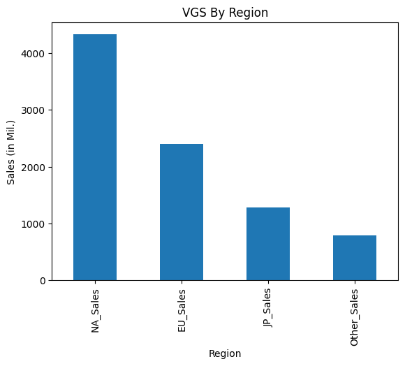
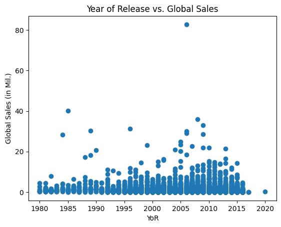
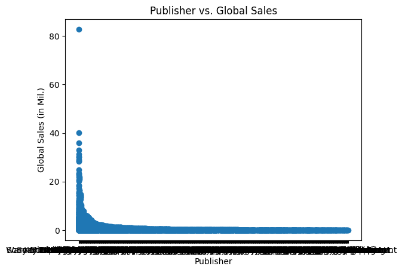
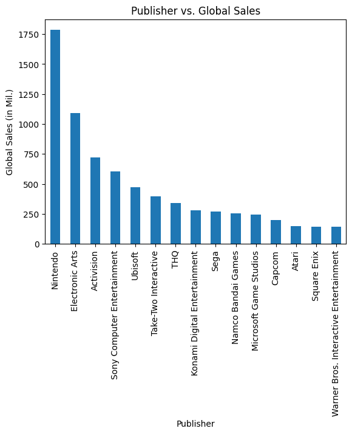
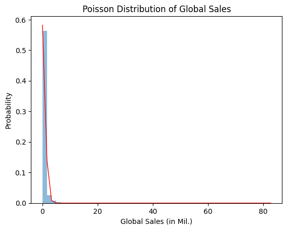

# Video Games Sale Data Analysis
> Tags: [Data Analytics], [Statistics]
>
> Technical Skills: [Python], [Jupyter Notebook], [Pandas], [Numpy], [Matplotlib]
>
> Theoretical Frameworks: [Poisson Distribution]

>[!NOTE]
> The dataset and the idea of the EDA goes to the **amazing** team of Workearly, a specialised educational professionals that offer extraordinary bootcamps.
> I started my journey of upskilling last February with them, and the learning structure they offered helped me become adept in 6 different tools in no time, including utilising Python as seen below.
> Make sure you check them out if you are interested in any sort of upskilling: https://www.workearly.co

A simplistic execution of EDA (Exploratory Data Analysis), to answer 7 questions, and perform a poisson distribution to model the data.


```python
import pandas as pd
import numpy as np
import matplotlib.pyplot as plt
import math
```


```python
# Calling the CSV
df = pd.read_csv(r'B:\Python Environments\Video Game Data Analysis\Raw Data\vgsales.csv')
#r'' because I just want to copy/paste the path without changing all the \ to / or to \\
```

## Cleaning the Dataset
Dropping N/A and nulls.


```python
df.dropna(inplace=True)
```

## Exploring the CSV's features


```python
df.head()
```


<div>
</style>
<table border="1" class="dataframe">
  <thead>
    <tr style="text-align: right;">
      <th></th>
      <th>Rank</th>
      <th>Name</th>
      <th>Platform</th>
      <th>Year</th>
      <th>Genre</th>
      <th>Publisher</th>
      <th>NA_Sales</th>
      <th>EU_Sales</th>
      <th>JP_Sales</th>
      <th>Other_Sales</th>
      <th>Global_Sales</th>
    </tr>
  </thead>
  <tbody>
    <tr>
      <th>0</th>
      <td>1</td>
      <td>Wii Sports</td>
      <td>Wii</td>
      <td>2006.0</td>
      <td>Sports</td>
      <td>Nintendo</td>
      <td>41.49</td>
      <td>29.02</td>
      <td>3.77</td>
      <td>8.46</td>
      <td>82.74</td>
    </tr>
    <tr>
      <th>1</th>
      <td>2</td>
      <td>Super Mario Bros.</td>
      <td>NES</td>
      <td>1985.0</td>
      <td>Platform</td>
      <td>Nintendo</td>
      <td>29.08</td>
      <td>3.58</td>
      <td>6.81</td>
      <td>0.77</td>
      <td>40.24</td>
    </tr>
    <tr>
      <th>2</th>
      <td>3</td>
      <td>Mario Kart Wii</td>
      <td>Wii</td>
      <td>2008.0</td>
      <td>Racing</td>
      <td>Nintendo</td>
      <td>15.85</td>
      <td>12.88</td>
      <td>3.79</td>
      <td>3.31</td>
      <td>35.82</td>
    </tr>
    <tr>
      <th>3</th>
      <td>4</td>
      <td>Wii Sports Resort</td>
      <td>Wii</td>
      <td>2009.0</td>
      <td>Sports</td>
      <td>Nintendo</td>
      <td>15.75</td>
      <td>11.01</td>
      <td>3.28</td>
      <td>2.96</td>
      <td>33.00</td>
    </tr>
    <tr>
      <th>4</th>
      <td>5</td>
      <td>Pokemon Red/Pokemon Blue</td>
      <td>GB</td>
      <td>1996.0</td>
      <td>Role-Playing</td>
      <td>Nintendo</td>
      <td>11.27</td>
      <td>8.89</td>
      <td>10.22</td>
      <td>1.00</td>
      <td>31.37</td>
    </tr>
  </tbody>
</table>
</div>


# Question 1: Top-selling Video Games


```python
# Group by name and sum of global sales
top_selling = df.groupby('Name')['Global_Sales'].sum()

# Sort by global sales
top_selling = top_selling.sort_values(ascending=False)

# Displaying the top 15 games
print(top_selling.head(15))
```

    Name
    Wii Sports                        82.74
    Grand Theft Auto V                55.92
    Super Mario Bros.                 45.31
    Tetris                            35.84
    Mario Kart Wii                    35.82
    Wii Sports Resort                 33.00
    Pokemon Red/Pokemon Blue          31.37
    Call of Duty: Modern Warfare 3    30.83
    New Super Mario Bros.             30.01
    Call of Duty: Black Ops II        29.72
    Call of Duty: Black Ops           29.40
    Wii Play                          29.02
    New Super Mario Bros. Wii         28.62
    Duck Hunt                         28.31
    Call of Duty: Ghosts              27.38
    Name: Global_Sales, dtype: float64
    

Most selling games is Wii Sports with 82.74m global sales, followed by Grand Theft Auto V with 55.92m global sales, followed by the old classic Super Mario Bros. with 45.31m global sales.

# Question 2: Which Platform was more popular


```python

# Group by platform and sum of global sales
top_platform = df.groupby('Platform')['Global_Sales'].sum()

# Sort by platform sales
top_platform = top_platform.sort_values(ascending=False)

# Displaying the top 10 platforms
print(top_platform.head(10))
```

    Platform
    PS2     1233.46
    X360     969.60
    PS3      949.35
    Wii      909.81
    DS       818.91
    PS       727.39
    GBA      305.62
    PSP      291.71
    PS4      278.10
    PC       254.70
    Name: Global_Sales, dtype: float64
    

Based on global sales, the most popular platform of all time is Playstation 2 with 1233.46m games being sold.

# Question 3: Genre Popularity #


```python


# Group by genre and sum of global sales
top_genre = df.groupby('Genre')['Global_Sales'].sum()

# Sort by genre sales
top_genre = top_genre.sort_values(ascending=False)

# Displaying the top 10 genres
print(top_genre.head(10))
```

    Genre
    Action          1722.84
    Sports          1309.24
    Shooter         1026.20
    Role-Playing     923.83
    Platform         829.13
    Misc             789.87
    Racing           726.76
    Fighting         444.05
    Simulation       389.98
    Puzzle           242.21
    Name: Global_Sales, dtype: float64
    

# Question 4: Sales by Region


```python
region_sales = df[['NA_Sales','EU_Sales','JP_Sales','Other_Sales']].sum()

# Creating the bar graph
region_sales.plot(kind='bar')
plt.title('VGS By Region')
plt.xlabel('Region')
plt.ylabel('Sales (in Mil.)')
plt.show
```


    <function matplotlib.pyplot.show(close=None, block=None)>


    

    


# Question 5, Hypothesis 1: Relationship between year of release and global sales


```python
# Creating the Scatterplot
plt.scatter(df['Year'],df['Global_Sales'])
plt.title('Year of Release vs. Global Sales')
plt.xlabel('YoR')
plt.ylabel('Global Sales (in Mil.)')
plt.show()
```


    

    


Clearly, there is no positive correlation between the year of release a game released against how it sold. If there was, we should be able to see for a specific year, density of points towards the higher scales of the Global Sales (the Y axis.)

Therefore, Hypothesis 1 is rejected.

# Question 6, Hypothesis 2: Relationship between publisher and global sales


```python
# Creating the Scatterplot
plt.scatter(df['Publisher'],df['Global_Sales'])
plt.title('Publisher vs. Global Sales')
plt.xlabel('Publisher')
plt.ylabel('Global Sales (in Mil.)')
plt.show()
```


    

    


Whoops! It seems we need to do an extra step for this one. Let's try to group them by sales and then sort them.


```python
# Grouping by the sum of sales
publisher_vs = df.groupby('Publisher')['Global_Sales'].sum()

# Sorting by highest selling publisher
publisher_vs = publisher_vs.sort_values(ascending=False)

# Creating the bar plot
publisher_vs.head(15).plot(kind='bar')
plt.title('Publisher vs. Global Sales')
plt.xlabel('Publisher')
plt.ylabel('Global Sales (in Mil.)')
plt.show()
```


    

    


In the graph above, we immediately observe that Nintendo and EA has had most sales of all times in video games sales. 

We could go as far to state that since the dataset supports that Nintendo did not achieve those numbers by an irregularity/outlier (i.e one good selling game), but through consistent successful entries, there is definitely something to be learnt from that company.

# Question 7: Would a Poisson distribution be appropriate to model the sales data?

## First Calculations

### Mean and variance calculation


```python
mean = df['Global_Sales'].mean()
var = df['Global_Sales'].var()
```

### Expected mean and variance calculation


```python
exp_mean = mean
exp_var = var
```

### Showing and comparing the mean & the variance vs. the expected values


```python
print('Mean sales', mean)
print('Variance of sales', var)
print('Expected mean', exp_mean)
print('Expected variance', exp_var)
```

    Mean sales 0.5409103185808114
    Variance of sales 2.456568802945086
    Expected mean 0.5409103185808114
    Expected variance 2.456568802945086
    

To evaluate that a Poisson distribution can be applied for the model, we need a goodness-of-fit test. That is done by calculating the mean and variance, as we have done above on steps *8.1.1.* and *8.1.2.* and by comparing the observed values to the expected values.

If the mean and var have approx. similar values or are equal, then the distribution can be applied. Also for each category, if the mean and var. vs the expected mean and var. have a closer range, then it definitely fits.

In this case, there is a quite substantial difference between mean and var. without even comparing the expected mean and var. Regardless, we will still attempt to fit the Poisson Distribution to the data and see how well it fits.

## Second Calculations

### Poisson Distribution


```python
def poisson_prob(k, lam):
    return (lam**k)*math.exp(-lam)/math.gamma(k+1)

mean = np.mean(df['Global_Sales'])

# Generating a histogram of the sales
n, bins, patches = plt.hist(df['Global_Sales'], bins=50, density=True, alpha=0.5)

# Calculating the distribution
poisson_dist = [poisson_prob(b,mean) for b in bins]

# Plotting the distribution over the histogram
plt.plot(bins, poisson_dist, 'r-', linewidth = 1)

# Labelling the plot
plt.title('Poisson Distribution of Global Sales')
plt.xlabel('Global Sales (in Mil.)')
plt.ylabel('Probability')
```


    Text(0, 0.5, 'Probability')


    

    


In the histogram above, the red line acts as the depiction of the distribution. To be more exact, the red line represents the Poisson probability mass function (PMF).

The PMF is a function over a sample of a discrete value X which annotates the probability of value X that is equals to a certain value (f(x) = P[X=x]).

As we had already seen on the goodness-for-fit test, the distribution does not work well, as it is clear that the PMF overestimates the frequency of low sales and underestimates that of the high volume of sales. That concludes that Poisson is indeed not a good fit for this dataset.

> [!NOTE]
> That does not necessarily mean that this data set does not follow *any* probability distribution, just that it does not follow *specifically* a Poisson distribution.
